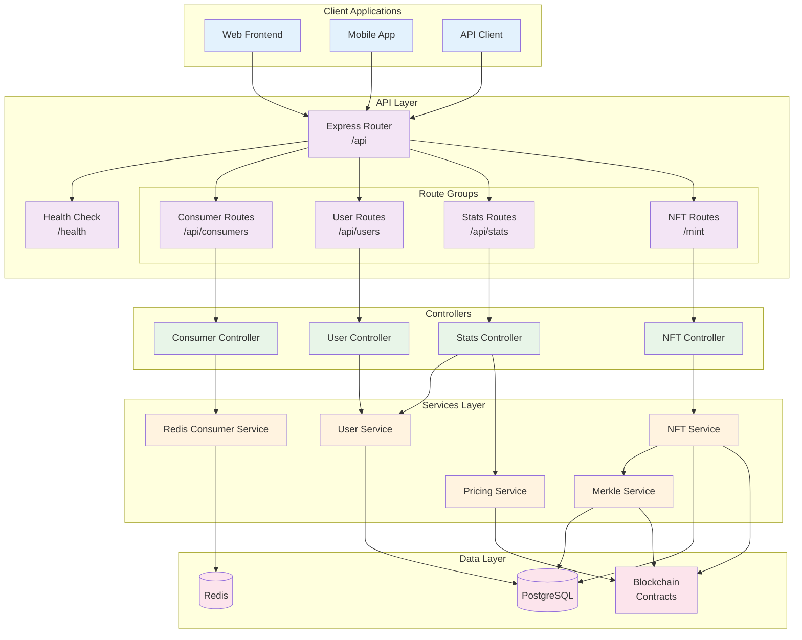
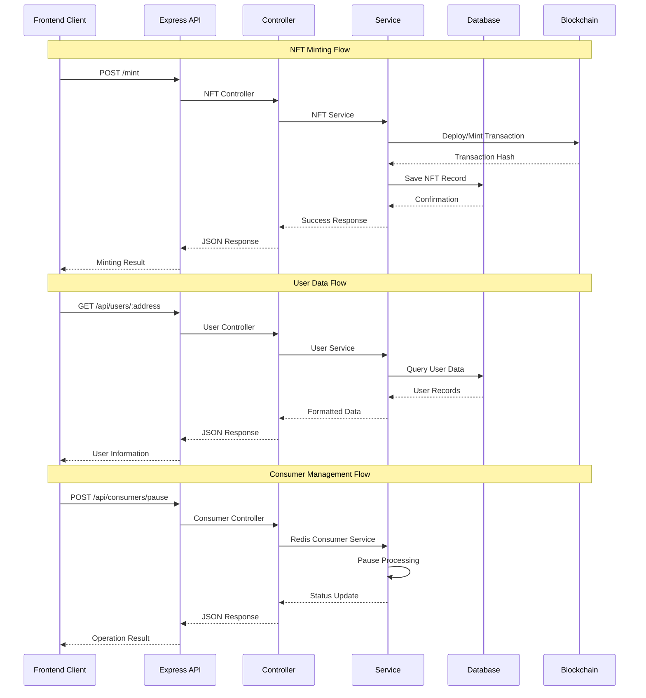

# Proof of Concept Consumer API Documentation

This document provides information about the available API endpoints for the frontend integration.

## API Architecture Overview



## API Endpoint Flow



## Endpoint Categories

### 🔧 **System Management**
- **Consumer Control**: Start, stop, pause, and resume blockchain event processing
- **Health Monitoring**: Service status, connection health, and system metrics
- **Merkle Operations**: Manual Merkle tree generation and submission

### 👤 **User Management** 
- **User Profiles**: Wallet-based user accounts and balance tracking
- **Transaction History**: Deposits, withdrawals, borrows, and transfers
- **Portfolio Summaries**: Cross-chain collateral and lending positions

### 📊 **Statistics & Analytics**
- **System Stats**: Processing metrics, success rates, and performance data
- **User Analytics**: Individual user statistics and activity summaries
- **Cross-Chain Metrics**: Multi-blockchain transaction and collateral data

### 🎨 **NFT Operations**
- **Minting**: Create new NFTs for users with automated blockchain deployment
- **Ownership Verification**: Check NFT ownership status and contract information
- **Transfer Tracking**: Monitor NFT transfers across supported chains

## Base URL

All API endpoints are prefixed with `/api`. The base URL depends on your environment:

- Local Development: `http://localhost:3000/api`
- Production: TBD

## Authentication

Currently, all API endpoints are public and do not require authentication.

## NFT Minting Endpoints

### Mint NFT

```
POST /mint
```

Mints a new NFT for a user on Berachain Bepolia.

**Request Body:**

```json
{
  "walletAddress": "0x1234567890abcdef1234567890abcdef12345678",
  "chainId": 80069
}
```

**Parameters:**

- `walletAddress` (required): The wallet address to mint the NFT to.
- `chainId` (optional): The chain ID (defaults to 80069 for Berachain Bepolia).

**Example Response (Success):**

```json
{
  "success": true,
  "message": "NFT minted successfully",
  "data": {
    "tokenId": "123",
    "transactionHash": "0xabcdef1234567890abcdef1234567890abcdef1234567890abcdef1234567890",
    "walletAddress": "0x1234567890abcdef1234567890abcdef12345678"
  }
}
```

**Example Response (Error):**

```json
{
  "success": false,
  "error": "User already has a minted NFT"
}
```

### Check User NFT Status

```
GET /mint/check/:walletAddress
```

Checks if a user already has an NFT minted.

**Parameters:**

- `walletAddress` (path parameter): The wallet address to check.

**Example Response:**

```json
{
  "success": true,
  "data": {
    "walletAddress": "0x1234567890abcdef1234567890abcdef12345678",
    "hasNft": true
  }
}
```

### Get Contract Information

```
GET /mint/contract-info
```

Retrieves information about the NFT contract.

**Example Response:**

```json
{
  "success": true,
  "data": {
    "contractAddress": "0x43c41E56Fb67ee48951af84298a97C261dFC1690",
    "name": "Positions NFT",
    "symbol": "POS",
    "totalSupply": "456",
    "chainId": 80069,
    "chainName": "bepolia"
  }
}
```

## User Endpoints

### Get User by Wallet Address

```
GET /api/users/:walletAddress
```

Retrieves a user by their wallet address.

**Parameters:**

- `walletAddress` (path parameter): The wallet address of the user.

**Example Response:**

```json
{
  "id": "uuid",
  "walletAddress": "0x1234567890abcdef1234567890abcdef12345678",
  "totalUsdBalance": 1000.0,
  "floatingUsdBalance": 800.0,
  "borrowedUsdAmount": 200.0,
  "pocNft": {
    "id": "uuid",
    "tokenId": 123,
    "contractAddress": "0xabcdef1234567890abcdef1234567890abcdef12"
  },
  "createdAt": "2023-01-01T00:00:00.000Z",
  "updatedAt": "2023-01-01T00:00:00.000Z"
}
```

### Get User Summary

```
GET /api/users/:walletAddress/summary
```

Retrieves a summary of the user's data, including balances, NFT info, and transaction counts.

**Parameters:**

- `walletAddress` (path parameter): The wallet address of the user.

**Example Response:**

```json
{
  "walletAddress": "0x1234567890abcdef1234567890abcdef12345678",
  "totalUsdBalance": 1000.0,
  "floatingUsdBalance": 800.0,
  "borrowedUsdAmount": 200.0,
  "hasNft": true,
  "nftDetails": {
    "id": "uuid",
    "tokenId": 123,
    "contractAddress": "0xabcdef1234567890abcdef1234567890abcdef12"
  },
  "transactionCounts": {
    "deposits": 5,
    "withdrawals": 2,
    "borrows": 1
  },
  "createdAt": "2023-01-01T00:00:00.000Z"
}
```

### Get User Deposits

```
GET /api/users/:walletAddress/deposits
```

Retrieves a list of deposits made by the user.

**Parameters:**

- `walletAddress` (path parameter): The wallet address of the user.
- `limit` (query parameter, optional): Number of items to return. Default: 10.
- `offset` (query parameter, optional): Number of items to skip. Default: 0.

**Example Response:**

```json
{
  "data": [
    {
      "id": "uuid",
      "txHash": "0xabcdef1234567890abcdef1234567890abcdef1234567890abcdef1234567890",
      "amount": "1.5",
      "tokenSymbol": "ETH",
      "usdValue": 3000.0,
      "createdAt": "2023-01-01T00:00:00.000Z"
    }
  ],
  "pagination": {
    "total": 5,
    "limit": 10,
    "offset": 0
  }
}
```

### Get User Withdrawals

```
GET /api/users/:walletAddress/withdrawals
```

Retrieves a list of withdrawals made by the user.

**Parameters:**

- `walletAddress` (path parameter): The wallet address of the user.
- `limit` (query parameter, optional): Number of items to return. Default: 10.
- `offset` (query parameter, optional): Number of items to skip. Default: 0.

**Example Response:**

```json
{
  "data": [
    {
      "id": "uuid",
      "txHash": "0xabcdef1234567890abcdef1234567890abcdef1234567890abcdef1234567890",
      "amount": "0.5",
      "tokenSymbol": "ETH",
      "usdValue": 1000.0,
      "createdAt": "2023-01-01T00:00:00.000Z"
    }
  ],
  "pagination": {
    "total": 2,
    "limit": 10,
    "offset": 0
  }
}
```

### Get User Borrows

```
GET /api/users/:walletAddress/borrows
```

Retrieves a list of borrows made by the user.

**Parameters:**

- `walletAddress` (path parameter): The wallet address of the user.
- `limit` (query parameter, optional): Number of items to return. Default: 10.
- `offset` (query parameter, optional): Number of items to skip. Default: 0.

**Example Response:**

```json
{
  "data": [
    {
      "id": "uuid",
      "txHash": "0xabcdef1234567890abcdef1234567890abcdef1234567890abcdef1234567890",
      "amount": "100",
      "tokenSymbol": "USDC",
      "usdValue": 100.0,
      "createdAt": "2023-01-01T00:00:00.000Z"
    }
  ],
  "pagination": {
    "total": 1,
    "limit": 10,
    "offset": 0
  }
}
```

## Stats Endpoints

### Get Platform Overview

```
GET /api/stats/overview
```

Retrieves an overview of platform statistics.

**Example Response:**

```json
{
  "platformStats": {
    "totalUsers": 100,
    "totalValueLocked": 1000000.00,
    "totalBorrowed": 200000.00,
    "transactions": {
      "deposits": 500,
      "withdrawals": 200,
      "borrows": 50,
      "total": 750
    }
  },
  "recentActivity": {
    "deposits": [
      {
        "id": "uuid",
        "txHash": "0xabcdef1234567890abcdef1234567890abcdef1234567890abcdef1234567890",
        "amount": "1.5",
        "tokenSymbol": "ETH",
        "usdValue": 3000.00,
        "createdAt": "2023-01-01T00:00:00.000Z",
        "user": {
          "walletAddress": "0x1234567890abcdef1234567890abcdef12345678"
        }
      }
    ],
    "withdrawals": [...],
    "borrows": [...]
  }
}
```

### Get Transaction History

```
GET /api/stats/transactions
```

Retrieves a list of all transactions on the platform.

**Parameters:**

- `limit` (query parameter, optional): Number of items to return. Default: 10.
- `offset` (query parameter, optional): Number of items to skip. Default: 0.
- `type` (query parameter, optional): Filter by transaction type - "deposit", "withdrawal", or "borrow".

**Example Response:**

```json
{
  "data": [
    {
      "id": "uuid",
      "txHash": "0xabcdef1234567890abcdef1234567890abcdef1234567890abcdef1234567890",
      "amount": "1.5",
      "tokenSymbol": "ETH",
      "usdValue": 3000.0,
      "createdAt": "2023-01-01T00:00:00.000Z",
      "user": {
        "walletAddress": "0x1234567890abcdef1234567890abcdef12345678"
      },
      "type": "deposit"
    }
  ],
  "pagination": {
    "total": 750,
    "totalByType": {
      "deposit": 500,
      "withdrawal": 200,
      "borrow": 50
    },
    "limit": 10,
    "offset": 0
  }
}
```

## Error Responses

All endpoints return standard HTTP status codes:

- `200 OK`: Request successful
- `400 Bad Request`: Invalid input
- `404 Not Found`: Resource not found
- `500 Internal Server Error`: Server error

Error responses have the following format:

```json
{
  "error": "Error message"
}
```

## Formatting Utilities

A formatter service is available on the backend to standardize data between the backend and frontend. Consider implementing similar formatting functions on the frontend for consistency:

- **Format Wallet Address**: `0x1234...5678`
- **Format USD**: `$1,234.56`
- **Format Token Amount**: `1.500000 ETH`
- **Format Date**: `Jan 1, 2023 12:34 PM`
- **Format Transaction Hash**: `0x1234...5678`
- **Format Transaction Type**: `Deposit`, `Withdrawal`, `Borrow`
