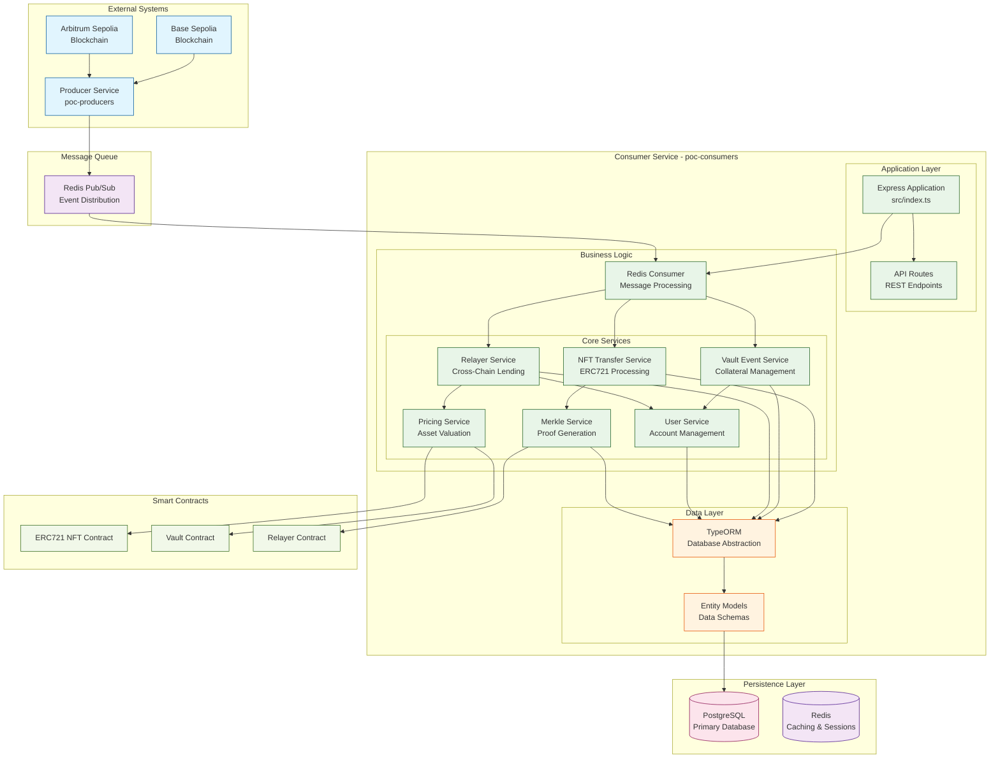
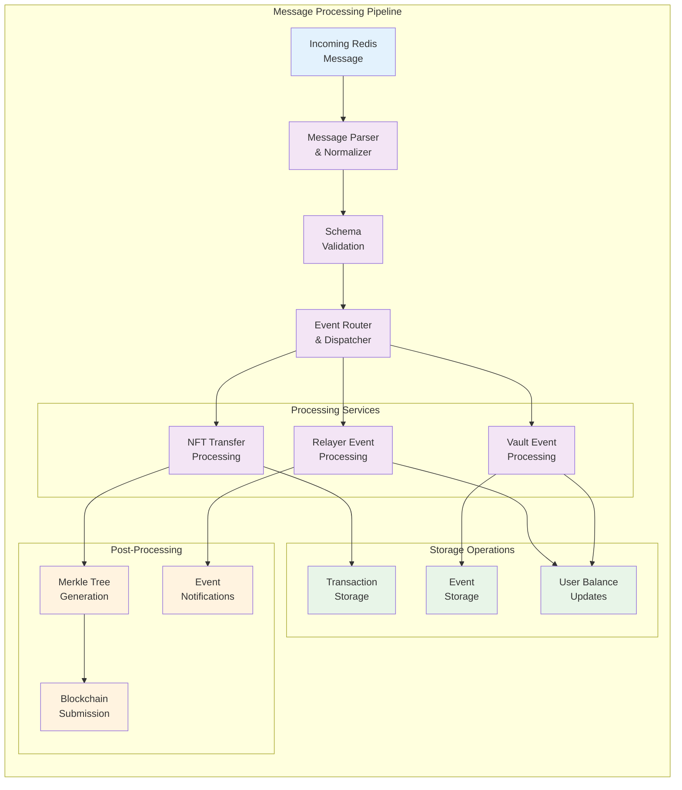
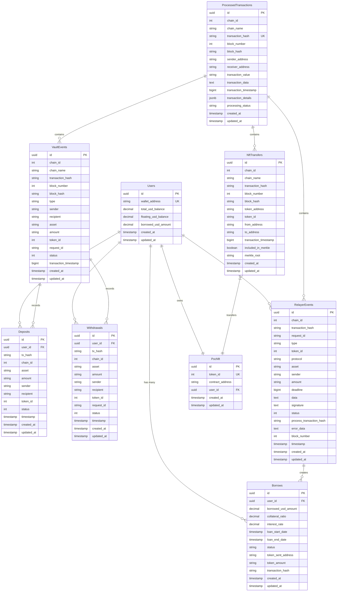
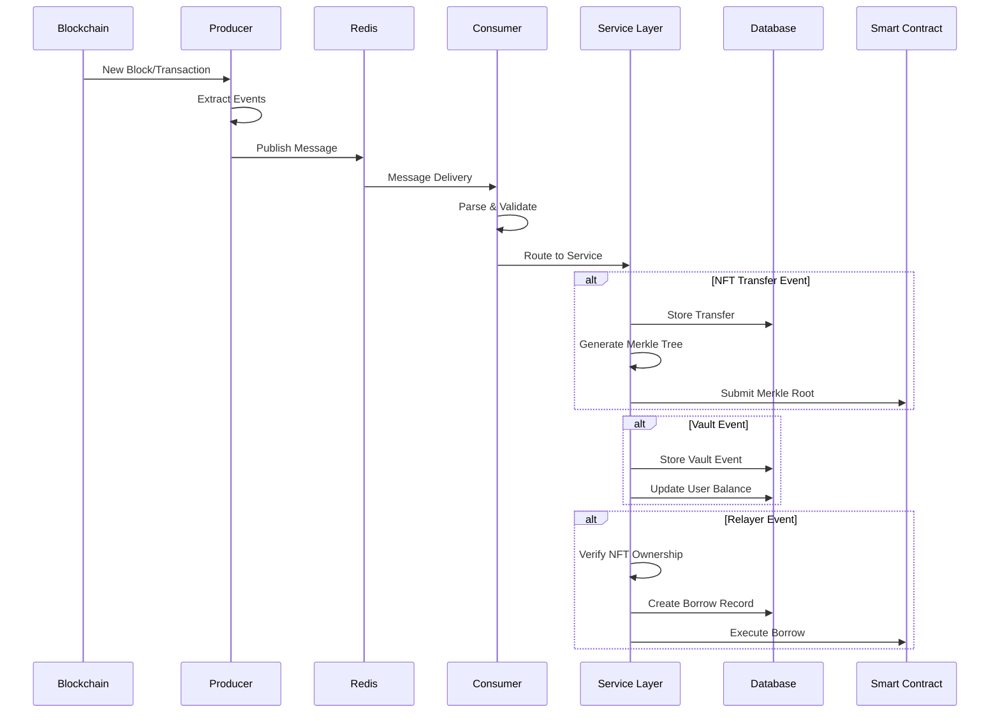
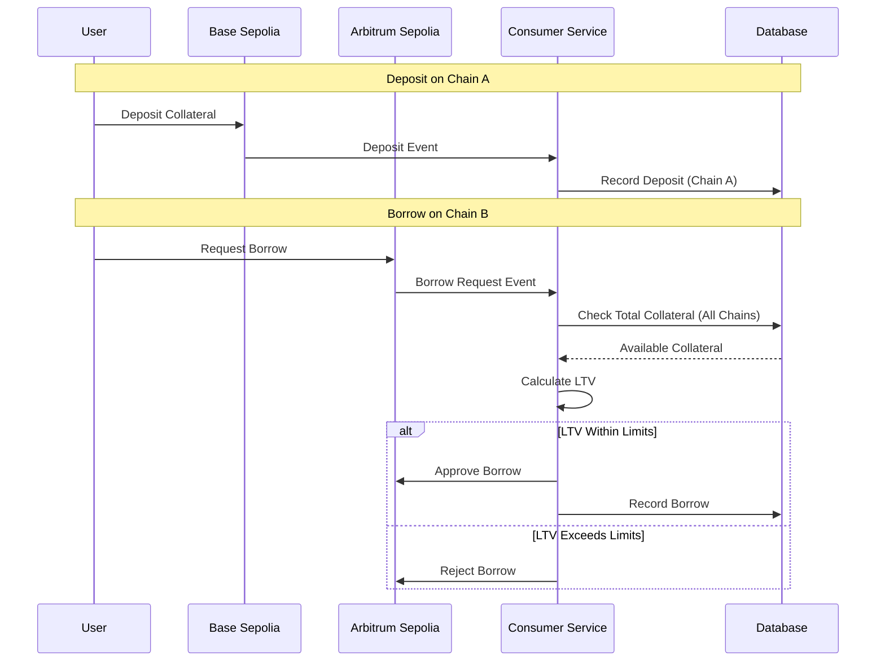

# System Architecture Documentation

This document provides a comprehensive overview of the Blockchain Transaction Consumer Service architecture, including detailed explanations of system components, data flows, and design decisions.

## Table of Contents

1. [System Overview](#system-overview)
2. [Architecture Diagrams](#architecture-diagrams)
3. [Component Details](#component-details)
4. [Data Flow Patterns](#data-flow-patterns)
5. [Cross-Chain Design](#cross-chain-design)
6. [Security Considerations](#security-considerations)
7. [Scalability & Performance](#scalability--performance)

## System Overview

The Blockchain Transaction Consumer Service is a **microservice-based architecture** designed to process blockchain events in real-time, manage cross-chain NFT collateral, and provide DeFi lending capabilities. The system follows **event-driven architecture** patterns with **Redis pub/sub** for message processing and **PostgreSQL** for persistent storage.

### Key Design Principles

- **Event-Driven Architecture**: Reactive processing of blockchain events
- **Microservice Separation**: Clear boundaries between business domains  
- **Cross-Chain Compatibility**: Multi-blockchain support with unified interfaces
- **Real-Time Processing**: Immediate event processing and response
- **Cryptographic Security**: Merkle proofs for trustless verification
- **Scalable Infrastructure**: Horizontal scaling capabilities

## Architecture Diagrams

### High-Level System Architecture



### Message Processing Pipeline



### Database Entity Relationships



## Component Details

### 1. Redis Consumer Service

**Location**: `src/redis/consumer.ts`

**Responsibilities**:
- Subscribe to Redis pub/sub channels for blockchain events
- Parse and normalize incoming message formats (legacy + enhanced)
- Route messages to appropriate processing services
- Handle connection management and error recovery
- Provide consumer control API (pause/resume/status)

**Key Features**:
- **Dual Format Support**: Handles both legacy and enhanced message structures
- **Graceful Degradation**: Continues processing if individual messages fail
- **Connection Resilience**: Automatic reconnection on Redis failures
- **Backpressure Handling**: Prevents message queue overflow

### 2. NFT Transfer Service

**Location**: `src/services/NftTransferService.ts`

**Responsibilities**:
- Extract ERC721 Transfer events from transaction logs
- Decode transfer parameters (from, to, tokenId)
- Store NFT ownership changes in database
- Trigger automatic Merkle tree generation
- Submit Merkle roots to relayer contracts

**Technical Implementation**:
```typescript
// Event signature for ERC721 Transfer
const TRANSFER_EVENT_TOPIC = "0xddf252ad1be2c89b69c2b068fc378daa952ba7f163c4a11628f55a4df523b3ef";

// Decode transfer event
const fromAddress = ethers.getAddress("0x" + log.topics[1].slice(26));
const toAddress = ethers.getAddress("0x" + log.topics[2].slice(26)); 
const tokenId = ethers.toBigInt(log.topics[3]);
```

### 3. Merkle Service

**Location**: `src/services/MerkleService.ts`

**Responsibilities**:
- Generate cryptographic Merkle trees from NFT ownership data
- Create verifiable proofs for cross-chain verification
- Submit Merkle roots to multiple relayer contracts
- Maintain proof history for audit trails

**Merkle Tree Construction**:
```typescript
// Create leaf for each NFT ownership
const leaf = ethers.solidityPackedKeccak256(
  ["address", "uint256"],
  [ownerAddress, tokenId]
);

// Build Merkle tree with sorted pairs
const merkleTree = new MerkleTree(leaves, keccak256, { sortPairs: true });
const root = merkleTree.getRoot().toString("hex");
```

### 4. Vault Event Service

**Location**: `src/services/VaultEventService.ts`

**Responsibilities**:
- Process deposit, withdrawal request, and withdrawal events
- Maintain user collateral balances across chains
- Validate withdrawal requests against available collateral
- Enforce chain-specific withdrawal constraints
- Calculate USD values for cross-chain operations

### 5. Relayer Service

**Location**: `src/services/RelayerService.ts`

**Responsibilities**:
- Handle collateral requests and processing events
- Verify NFT ownership through Merkle proofs
- Calculate loan-to-value (LTV) ratios
- Process cross-chain borrow requests
- Manage borrow approval/rejection workflow

## Data Flow Patterns

### Event Processing Flow



### Cross-Chain Collateral Flow



## Cross-Chain Design

### Multi-Chain Support Architecture

The system is designed to support multiple blockchain networks through a **unified interface pattern**:

1. **Chain Configuration**: Standardized chain definitions with RPC URLs, contract addresses, and asset configurations
2. **Event Normalization**: Common event structure across different blockchain implementations  
3. **Cross-Chain Aggregation**: Unified view of user assets and collateral across all supported chains
4. **Chain-Specific Constraints**: Enforcement of withdrawal limitations to originating chains

### Supported Networks

- **Base Sepolia (Primary)**: NFT contract deployment and primary operations
- **Arbitrum Sepolia (Secondary)**: Cross-chain lending and collateral verification
- **Extensible Design**: Additional chains can be added through configuration

## Security Considerations

### Cryptographic Security

1. **Merkle Proofs**: Cryptographically secure ownership verification
2. **Private Key Management**: Secure handling of blockchain transaction signing
3. **Message Validation**: Schema validation for all incoming events
4. **Database Integrity**: Foreign key constraints and transaction atomicity

### Cross-Chain Security

1. **Ownership Verification**: Merkle proof validation before cross-chain operations
2. **LTV Enforcement**: Strict loan-to-value ratio limits
3. **Chain Isolation**: Withdrawal restrictions to prevent cross-chain exploits
4. **Event Deduplication**: Prevention of duplicate event processing

## Scalability & Performance

### Horizontal Scaling

- **Stateless Services**: All business logic services are stateless and horizontally scalable
- **Database Connection Pooling**: Efficient database connection management
- **Redis Clustering**: Support for Redis cluster deployments
- **Load Balancing**: API layer can be load balanced across multiple instances

### Performance Optimizations

- **Batch Processing**: Efficient batch operations for database writes
- **Indexed Queries**: Optimized database indexes for common query patterns
- **Caching Strategy**: Redis caching for frequently accessed data
- **Async Processing**: Non-blocking I/O for blockchain interactions

### Monitoring & Observability

- **Structured Logging**: Winston-based logging with multiple levels
- **Health Checks**: Comprehensive health check endpoints
- **Metrics Collection**: Performance and business metrics tracking
- **Error Handling**: Graceful error handling with proper logging and recovery 