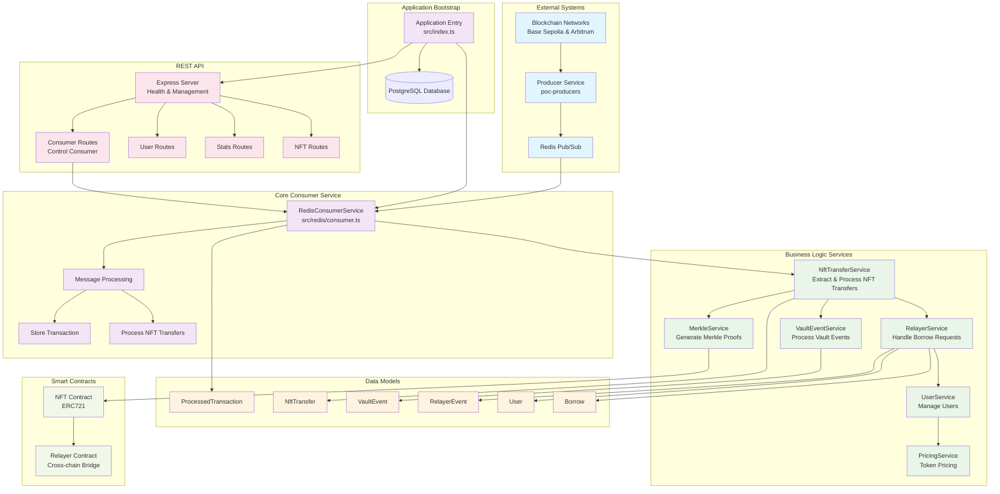
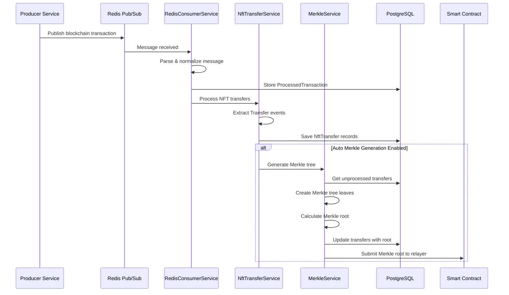
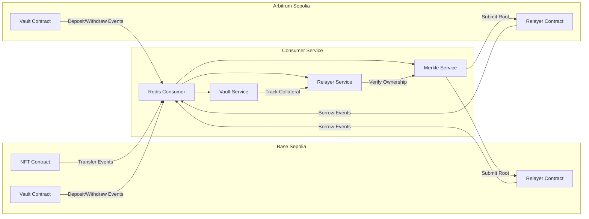

# Blockchain Transaction Consumer Service

A scalable Redis consumer service designed to process blockchain transaction events from multiple chains and perform custom processing on them.

## Architecture

This service consumes blockchain transaction events produced by the blockchain indexer service (`poc-producers`) and processes them based on configuration. The architecture follows:

## System Architecture Overview



## Detailed Data Flow Process



## Cross-Chain Architecture



## Project Structure

```
src/
├── config/            # Configuration files
│   ├── env.ts         # Environment variables configuration
│   └── contracts.ts   # Blockchain contract configurations
├── controllers/       # API controllers
│   └── consumer.controller.ts    # Consumer management endpoints
├── database/          # Database related code
│   ├── data-source.ts # TypeORM configuration
│   └── migrations/    # Database migrations
├── kafka/             # Kafka related code
│   └── consumer.ts    # Kafka consumer implementation
├── models/            # Database models/entities
│   ├── ProcessedTransaction.ts # Transaction entity
│   ├── NftTransfer.ts          # NFT Transfer entity
│   ├── VaultEvent.ts           # Vault event entity
│   ├── RelayerEvent.ts         # Relayer event entity
│   ├── User.ts                 # User entity
│   └── Borrow.ts               # Borrow record entity
├── routes/            # API routes
│   ├── index.ts       # Main router
│   └── consumer.routes.ts # Consumer routes
├── services/          # Business logic services
│   ├── NftTransferService.ts   # NFT transfer processing service
│   ├── VaultEventService.ts    # Vault event processing service
│   ├── RelayerService.ts       # Relayer event processing service
│   ├── MerkleService.ts        # Merkle proof verification service
│   └── PricingService.ts       # Token pricing service
├── utils/             # Utility functions
│   └── logger.ts      # Logging utility
├── app.ts             # Main application class
└── index.ts           # Application entry point
```

## Key Components Explanation

### 1. **Message Processing Flow**
- **Producer Service** indexes blockchain transactions and publishes them to Redis
- **RedisConsumerService** subscribes to Redis channels and processes incoming messages
- Supports both legacy and enhanced message formats for backward compatibility
- Automatically stores all processed transactions in PostgreSQL for audit trails

### 2. **NFT Transfer Processing**
- **NftTransferService** extracts ERC721 Transfer events from transaction logs
- Decodes token transfers (from, to, tokenId) using ethers.js library
- Stores transfer data in PostgreSQL for ownership tracking
- Automatically triggers Merkle tree generation for cross-chain verification

### 3. **Merkle Tree Generation & Cross-Chain Verification**
- Automatically generates cryptographic Merkle trees from NFT ownership data
- Creates verifiable proofs for cross-chain NFT ownership validation
- Submits Merkle roots to relayer smart contracts on multiple blockchains
- Enables secure cross-chain collateral verification without centralized oracles

### 4. **Multi-Service Architecture**
- **VaultEventService**: Processes deposit/withdrawal vault events across chains
- **RelayerService**: Handles cross-chain borrow requests with NFT collateral verification
- **UserService**: Manages user accounts, balances, and authentication
- **PricingService**: Integrates with price feeds for accurate token valuations
- **MerkleService**: Provides cryptographic proof generation and verification

### 5. **Cross-Chain Collateral Management**
- Tracks collateral deposits across multiple blockchain networks
- Calculates unified USD values for cross-chain lending decisions
- Enforces chain-specific withdrawal constraints for security
- Supports borrowing against total cross-chain collateral portfolio

### 6. **API Management & Monitoring**
- RESTful API for real-time monitoring and service control
- Health checks, consumer pause/resume functionality
- Manual Merkle generation triggers for emergency operations
- Comprehensive statistics and user management endpoints
- Live service status and connection monitoring

### 7. **Database Architecture & Persistence**
- PostgreSQL with TypeORM for robust data persistence
- Comprehensive entity relationships and foreign key constraints
- Database migrations for schema evolution and deployment
- Optimized queries for real-time processing and reporting

## Core Features

### 🔗 **Cross-Chain Compatibility**
- Supports Base Sepolia and Arbitrum Sepolia testnets
- Unified collateral tracking across multiple blockchains
- Cross-chain borrowing with chain-specific withdrawal constraints

### 🌳 **Merkle Proof System**
- Automatic generation of cryptographic ownership proofs
- Real-time submission to relayer contracts
- Secure cross-chain verification without centralized trust

### 💰 **DeFi Lending Protocol**
- NFT-collateralized lending with configurable LTV ratios
- Multi-asset support (ETH, USDC, and extensible to other tokens)
- Real-time price integration for accurate valuations

### 📊 **Real-Time Processing**
- Event-driven architecture with Redis pub/sub
- Immediate transaction processing and storage
- Live API monitoring and control interfaces

### 🔒 **Security & Reliability**
- TypeScript for type safety and developer experience
- Comprehensive error handling and graceful shutdowns
- Database constraints and transaction integrity

## Getting Started

### Prerequisites

- Node.js (v18+)
- TypeScript
- Kafka cluster
- PostgreSQL database
- Access to Bepolia and Arbitrum Sepolia testnets

### Installation

1. Clone the repository:

```
git clone <repository-url>
cd poc-consumers
```

2. Install dependencies:

```
yarn install
```

3. Create a `.env` file based on the `.env-example`:

```
# API Configuration
API_PORT=3000
API_HOST=localhost

# Database Configuration
DATABASE_HOST=localhost
DATABASE_PORT=5432
DATABASE_USERNAME=postgres
DATABASE_PASSWORD=postgres
DATABASE_NAME=nft_transfers
DATABASE_SYNCHRONIZE=false
DATABASE_LOGGING=false

# Kafka Configuration
KAFKA_CLIENT_ID=nft-transfer-consumer
KAFKA_CONSUMER_GROUP_ID=nft-transfer-group
KAFKA_BROKERS=localhost:9092
KAFKA_TOPIC=blockchain-transactions

# Blockchain Configuration - BEpolia
BEPOLIA_RPC_URL=https://rpc.ankr.com/base_sepolia
BEPOLIA_RELAYER_ADDRESS=0x0987654321098765432109876543210987654321
POC_NFT_CONTRACT_ADDRESS=0x1234567890123456789012345678901234567890

# Blockchain Configuration - Arbitrum Sepolia
ARBITRUM_SEPOLIA_RPC_URL=https://sepolia-rollup.arbitrum.io/rpc
ARBITRUM_SEPOLIA_RELAYER_ADDRESS=0x2468024680246802468024680246802468024680

# Private Key (for submitting Merkle roots to relayer contracts)
PRIVATE_KEY=YOUR_PRIVATE_KEY_HERE
```

4. Set up the database:

```
yarn migration:run
```

5. Build the project:

```
yarn build
```

6. Start the service:

```
yarn start
```

For development with hot reloading:

```
yarn dev
```

## API Endpoints

The service exposes REST APIs for monitoring and management:

- `GET /health` - Overall service health check
- `GET /api/consumers/status` - Get consumer status
- `POST /api/consumers/pause` - Pause the consumer
- `POST /api/consumers/resume` - Resume a paused consumer
- `POST /api/consumers/merkle` - Manually trigger Merkle root generation

## Database Schema

The service uses a PostgreSQL database with the following schemas:

### Processed Transactions Table

```sql
CREATE TABLE processed_transactions (
  id UUID PRIMARY KEY,
  chain_id INTEGER NOT NULL,
  chain_name VARCHAR(50) NOT NULL,
  transaction_hash VARCHAR(66) NOT NULL UNIQUE,
  block_number INTEGER NOT NULL,
  block_hash VARCHAR(66) NOT NULL,
  sender_address VARCHAR(66) NOT NULL,
  receiver_address VARCHAR(66),
  transaction_value VARCHAR(78),
  transaction_data TEXT,
  matched_topics TEXT,
  transaction_timestamp BIGINT NOT NULL,
  transaction_details JSONB,
  processing_status VARCHAR DEFAULT 'processed',
  created_at TIMESTAMP WITH TIME ZONE DEFAULT CURRENT_TIMESTAMP,
  updated_at TIMESTAMP WITH TIME ZONE DEFAULT CURRENT_TIMESTAMP
);
```

### NFT Transfers Table

```sql
CREATE TABLE nft_transfers (
  id UUID PRIMARY KEY,
  chain_id INTEGER NOT NULL,
  chain_name VARCHAR(50) NOT NULL,
  transaction_hash VARCHAR(66) NOT NULL,
  block_number INTEGER NOT NULL,
  block_hash VARCHAR(66) NOT NULL,
  token_address VARCHAR(42) NOT NULL,
  token_id VARCHAR(78) NOT NULL,
  from_address VARCHAR(42) NOT NULL,
  to_address VARCHAR(42) NOT NULL,
  transaction_timestamp BIGINT NOT NULL,
  included_in_merkle BOOLEAN DEFAULT FALSE,
  merkle_root VARCHAR(66),
  created_at TIMESTAMP WITH TIME ZONE DEFAULT CURRENT_TIMESTAMP,
  updated_at TIMESTAMP WITH TIME ZONE DEFAULT CURRENT_TIMESTAMP,
  UNIQUE(transaction_hash)
);
```

### Vault Events Table

```sql
CREATE TABLE vault_events (
  id UUID PRIMARY KEY,
  chain_id INTEGER NOT NULL,
  chain_name VARCHAR(50) NOT NULL,
  transaction_hash VARCHAR(66) NOT NULL,
  block_number INTEGER NOT NULL,
  block_hash VARCHAR(66) NOT NULL,
  type VARCHAR(20) NOT NULL, -- deposit, withdraw_request, withdraw
  sender VARCHAR(42) NOT NULL,
  recipient VARCHAR(42),
  asset VARCHAR(42) NOT NULL,
  amount VARCHAR(78) NOT NULL,
  token_id INTEGER NOT NULL,
  request_id VARCHAR(66),
  status INTEGER DEFAULT 1, -- 1: pending, 2: completed, 3: rejected
  transaction_timestamp BIGINT NOT NULL,
  created_at TIMESTAMP WITH TIME ZONE DEFAULT CURRENT_TIMESTAMP,
  updated_at TIMESTAMP WITH TIME ZONE DEFAULT CURRENT_TIMESTAMP,
  UNIQUE(transaction_hash, type, token_id, asset)
);
```

### Relayer Events Table

```sql
CREATE TABLE relayer_events (
  id UUID PRIMARY KEY,
  chain_id INTEGER NOT NULL,
  transaction_hash VARCHAR(66) NOT NULL,
  request_id VARCHAR(66) NOT NULL,
  type VARCHAR(20) NOT NULL, -- collateral_request, collateral_process
  token_id INTEGER NOT NULL,
  protocol VARCHAR(42),
  asset VARCHAR(42),
  sender VARCHAR(42) NOT NULL,
  amount VARCHAR(78),
  deadline BIGINT,
  data TEXT,
  signature TEXT,
  status INTEGER DEFAULT 1, -- 1: pending, 2: approved, 3: rejected
  process_transaction_hash VARCHAR(66),
  error_data TEXT,
  block_number INTEGER NOT NULL,
  timestamp TIMESTAMP WITH TIME ZONE,
  created_at TIMESTAMP WITH TIME ZONE DEFAULT CURRENT_TIMESTAMP,
  updated_at TIMESTAMP WITH TIME ZONE DEFAULT CURRENT_TIMESTAMP,
  UNIQUE(request_id, chain_id, type)
);
```

### User Table

```sql
CREATE TABLE users (
  id UUID PRIMARY KEY,
  wallet_address VARCHAR(42) NOT NULL UNIQUE,
  total_usd_balance DECIMAL(18,2) DEFAULT 0,
  floating_usd_balance DECIMAL(18,2) DEFAULT 0,
  borrowed_usd_amount DECIMAL(18,2) DEFAULT 0,
  created_at TIMESTAMP WITH TIME ZONE DEFAULT CURRENT_TIMESTAMP,
  updated_at TIMESTAMP WITH TIME ZONE DEFAULT CURRENT_TIMESTAMP
);
```

### Borrow Table

```sql
CREATE TABLE borrows (
  id UUID PRIMARY KEY,
  user_id UUID NOT NULL REFERENCES users(id),
  borrowed_usd_amount DECIMAL(18,2) NOT NULL,
  collateral_ratio DECIMAL(18,2) NOT NULL,
  interest_rate DECIMAL(18,2) NOT NULL,
  loan_start_date TIMESTAMP WITH TIME ZONE NOT NULL,
  loan_end_date TIMESTAMP WITH TIME ZONE,
  status VARCHAR(20) NOT NULL, -- active, repaid, liquidated
  token_sent_address VARCHAR(42) NOT NULL,
  token_amount VARCHAR(78) NOT NULL,
  transaction_hash VARCHAR(66) NOT NULL,
  created_at TIMESTAMP WITH TIME ZONE DEFAULT CURRENT_TIMESTAMP,
  updated_at TIMESTAMP WITH TIME ZONE DEFAULT CURRENT_TIMESTAMP
);
```

## NFT Transfer Processing

The service detects ERC721 transfers from the specified NFT contract address on the BEpolia network and:

1. Records all transfers in the database
2. Periodically generates a Merkle tree of NFT ownership
3. Submits the Merkle root to relayer contracts on both BEpolia and Arbitrum Sepolia chains

This enables cross-chain verification of NFT ownership across multiple networks.

The Merkle tree generation occurs either:

- Automatically every hour
- Manually via the `/api/consumers/merkle` endpoint

## Vault Event Processing

The VaultEventService tracks and processes three types of vault events:

1. **Deposit Events**: Records when users deposit collateral into the vault
2. **Withdraw Request Events**: Tracks when users request to withdraw their collateral
3. **Withdraw Events**: Records actual withdrawals of collateral

The service:

- Validates withdrawal requests against available collateral
- Maintains a running balance of user collateral by token and asset
- Prevents users from withdrawing more than they have deposited
- Associates withdrawals with their corresponding request IDs

## Borrow Request Processing

The RelayerService handles borrow requests against deposited collateral:

1. **Collateral Request Events**: Records when users request to borrow against their collateral
2. **Collateral Process Events**: Tracks the approval or rejection of borrow requests

The service:

- Verifies NFT ownership through the MerkleService
- Calculates asset values and loan-to-value (LTV) ratios
- Checks if borrow requests are within allowable LTV limits
- Creates borrow records for approved requests
- Processes borrowing transactions on-chain

## Cross-Chain Functionality

The system supports cross-chain operations with the following features:

1. **Cross-Chain Collateral Tracking**:

   - Collateral deposited on any supported chain (BEpolia or Arbitrum Sepolia) is tracked in a unified manner
   - The system converts all assets to USD value for consistent collateral calculation across chains
   - Total available collateral is calculated by aggregating deposits from all chains

2. **Cross-Chain Borrowing**:

   - Users can borrow against their total collateral on any supported chain
   - If a user deposits on BEpolia, they can initiate a borrow on Arbitrum Sepolia (and vice versa)
   - Borrowing limits are calculated based on the total collateral value across all chains

3. **Chain-Specific Withdrawals**:
   - Withdrawals must be performed on the same chain where the deposits were made
   - A user who deposited ETH on BEpolia can only withdraw ETH from BEpolia, not from Arbitrum Sepolia
   - The system tracks deposits and withdrawals with chain-specific identifiers to enforce this constraint

This design allows for flexibility in borrowing while maintaining the security of chain-specific withdrawals.

## Multi-Chain Relayer Support

The service supports submitting the same Merkle root to multiple chain relayers:

1. **BEpolia**: The chain where the NFT contract is deployed and transfers are monitored
2. **Arbitrum Sepolia**: Additional chain where the Merkle root is submitted for cross-chain verification

If either relayer submission fails, the service will log the error but continue with the other chains.

## Extending the Service

To support additional NFT contracts or chains, modify the `contracts.ts` configuration file:

```typescript
export const SUPPORTED_CHAINS = [
  {
    chainId: 80069, // BEpolia
    chainName: "bepolia",
    httpsRpcUrl: process.env.BEPOLIA_RPC_URL,
    relayerAddress: process.env.BEPOLIA_RELAYER_ADDRESS,
    nftContractAddress: process.env.POC_NFT_CONTRACT_ADDRESS,
    assets: [
      {
        symbol: "ETH",
        address: "0x0000000000000000000000000000000000000000",
        decimals: 18,
        ltv: 75, // 75% LTV for ETH
      },
      {
        symbol: "USDC",
        address: "0xUSdcAddressOnBepolia",
        decimals: 6,
        ltv: 85, // 85% LTV for USDC
      },
    ],
  },
  {
    chainId: 421614, // Arbitrum Sepolia
    chainName: "arbitrum-sepolia",
    httpsRpcUrl: process.env.ARBITRUM_SEPOLIA_RPC_URL,
    relayerAddress: process.env.ARBITRUM_SEPOLIA_RELAYER_ADDRESS,
    assets: [
      {
        symbol: "ETH",
        address: "0x0000000000000000000000000000000000000000",
        decimals: 18,
        ltv: 75,
      },
      {
        symbol: "USDC",
        address: "0xUSdcAddressOnArbitrum",
        decimals: 6,
        ltv: 85,
      },
    ],
  },
];
```

## License

MIT
